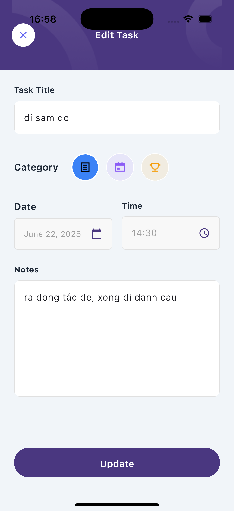
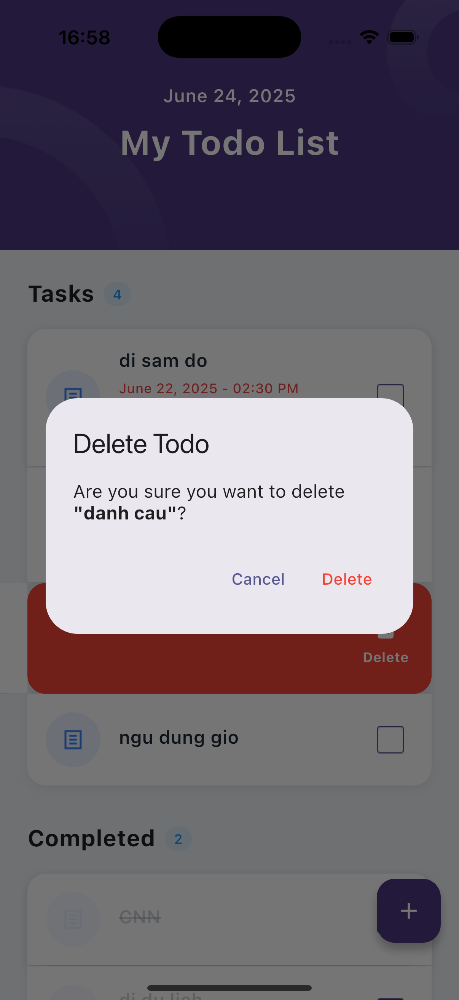

# 📝 Todo App

Ứng dụng quản lý công việc (Todo) được xây dựng bằng Flutter với hệ thống thông báo báo thức và đồng bộ dữ liệu thời gian thực.

## ✨ Tính năng chính

- **📋 Quản lý Todo**: Tạo, sửa, xóa và đánh dấu hoàn thành công việc
- **🔔 Thông báo báo thức**: Nhắc nhở bằng thông báo khi đến giờ
- **📅 Lịch trình linh hoạt**: Đặt ngày và giờ cho từng công việc (tùy chọn)
- **🏷️ Phân loại**: Organizer công việc theo danh mục (List, Calendar, Trophy)
- **👆 Swipe để xóa**: Vuốt sang trái để xóa công việc nhanh chóng
- **☁️ Đồng bộ thời gian thực**: Dữ liệu được lưu trữ và đồng bộ qua Supabase
- **🔐 Định danh thiết bị**: Mỗi thiết bị có ID duy nhất, tồn tại qua các lần cài đặt

## 🛠️ Công nghệ sử dụng

- **Frontend**: Flutter (Dart)
- **Backend**: Supabase (PostgreSQL + Real-time)
- **State Management**: Flutter Bloc + Cubit
- **Local Storage**: Flutter Secure Storage (iOS Keychain)
- **Notifications**: Flutter Local Notifications
- **Navigation**: Go Router

## 📱 Hỗ trợ nền tảng

- ✅ iOS (14.0+)
- 🔄 Android (đang phát triển)

## Minh hoạ

  

  

  

  

### Yêu cầu
- Flutter SDK (3.0.0+)
- Xcode (cho iOS)
- Supabase account
